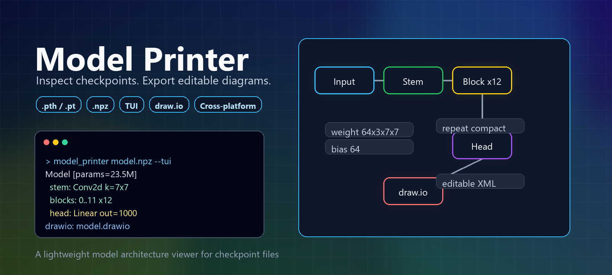

<p align="center">
  
</p>

<h1 align="center">Model Printer</h1>

<p align="center">
  A lightweight model architecture viewer for checkpoint files.
</p>

<p align="center">
  <a href="README.zh-CN.md">中文文档</a>
  ·
  <a href="https://github.com/Lcollection/Model_Printer/actions">CI</a>
</p>

Model Printer inspects model checkpoint files and turns parameter names and
tensor shapes into a readable model hierarchy. It can print the structure in
the terminal, browse it with a Vim-inspired TUI, compact repeated layers, and
export an editable `.drawio` diagram for diagrams.net / draw.io.

It is useful when you have only a checkpoint file and do not have the original
model source code nearby.

## Features

- Read PyTorch `.pth` / `.pt` checkpoints.
- Read NumPy `.npz` weight archives.
- Automatically detect common checkpoint fields such as `state_dict`,
  `model_state_dict`, `model`, `net`, and `module`.
- Strip the common DataParallel `module.` prefix by default.
- Build a hierarchical model tree from parameter keys.
- Show tensor shapes, parameter counts, direct parameters, and child modules.
- Infer common layer summaries from tensor shapes, including `Conv2d`,
  `Linear`, `Embedding`, `BatchNorm`, and `LayerNorm`.
- Compact consecutive repeated sibling layers, for example `0..11 x12`.
- Open an interactive TUI for browsing layers.
- Export `.drawio` XML files that can be edited in draw.io / diagrams.net.
- Support Windows, macOS, and Linux.

## Installation

The base install includes `numpy` and `rich`. It supports the welcome screen,
the TUI, `.npz` files, and `.drawio` export.

Windows PowerShell:

```powershell
cd E:\github\modal_printer
python -m pip install -e .
```

macOS / Linux:

```bash
cd /path/to/modal_printer
python -m pip install -e .
```

To read PyTorch `.pth` / `.pt` files, install the optional PyTorch extra:

Windows PowerShell:

```powershell
python -m pip install -e ".[pytorch]"
```

macOS / Linux:

```bash
python -m pip install -e '.[pytorch]'
```

If you need CUDA, MPS, or a specific CPU build, install `torch` using the command
recommended by the [PyTorch website](https://pytorch.org/), then install this
project normally.

## Quick Start

After installation, both commands are available:

```bash
model_printer
model-printer
```

Run without arguments to open the Vim-like welcome screen:

```bash
model_printer
```

From the welcome screen, open a checkpoint with:

```text
:open /path/to/model.npz
```

On Windows, paths such as this work as well:

```text
:open E:\models\model.pth
```

Inspect a checkpoint in the TUI directly:

```bash
model_printer /path/to/model.npz --tui
```

Print the structure and export a draw.io diagram:

```bash
model_printer /path/to/model.pth -o model.drawio
```

Only print the structure:

```bash
model_printer /path/to/model.pth --no-drawio
```

Keep the `module.` prefix:

```bash
model_printer /path/to/model.pth --keep-module-prefix
```

Strip a shared prefix:

```bash
model_printer /path/to/model.pth --strip-prefix backbone.
```

Change the repeated-layer compaction threshold:

```bash
model_printer /path/to/model.pth --min-repeat 3
```

Some older checkpoints contain pickled Python objects instead of a plain
`state_dict`. By default, Model Printer prefers PyTorch's safer weights-only
loading mode. If the file is trusted, you can enable unsafe pickle loading:

```bash
model_printer /path/to/model.pth --unsafe-load
```

## TUI Keys

The `--tui` mode opens a terminal UI with a collapsible structure tree on the
left and selected-layer details on the right.

| Key | Action |
| --- | --- |
| `Up` / `Down` or `j` / `k` | Move selection |
| `Enter` / `Space` | Expand or collapse the selected layer |
| `Left` / `Right` or `h` / `l` | Collapse or expand |
| `PageUp` / `PageDown` or `u` / `d` | Scroll faster |
| `a` | Expand all |
| `c` | Collapse to root |
| `e` | Export the full structure to `.drawio` |
| `q` | Quit |

## Example Output

Terminal output looks like this:

```text
Model [params=23.5M]
  stem: Conv2d out=64, in=3, k=7x7 [params=9.4K]
  layer1
    0..2 x3: Block [params=221.7K each]
      conv1: Conv2d out=64, in=64, k=3x3
      bn1: BatchNorm channels=64
```

The generated `.drawio` file can be opened with diagrams.net / draw.io through
`File -> Open From -> Device`, or by dragging the file into the editor.

## NPZ Format

For `.npz` files, each array should be saved with a parameter-like key:

```python
import numpy as np

np.savez(
    "model.npz",
    **{
        "stem.conv.weight": stem_weight,
        "head.weight": head_weight,
    },
)
```

Slash-separated keys are normalized automatically:

```text
backbone/0/conv/weight -> backbone.0.conv.weight
```

Object arrays and pickled values are intentionally not supported for `.npz`
files. Model Printer uses `np.load(..., allow_pickle=False)`.

## Platform Support

Model Printer targets:

- Windows 10/11 with PowerShell or Windows Terminal.
- macOS with Terminal, iTerm2, or another ANSI-capable terminal.
- Linux desktop terminals and SSH terminals.

Cross-platform details:

- Windows keyboard input uses `msvcrt`.
- macOS and Linux keyboard input uses `termios`.
- Paths are handled with Python `pathlib`.
- CI runs on `ubuntu-latest`, `macos-latest`, and `windows-latest`.
- PyTorch is optional so `.npz` and TUI usage are not blocked by platform-
  specific PyTorch wheels.

## Limitations

Plain checkpoint files usually store parameter tensors, not the full dynamic
forward graph. Model Printer can reliably show parameter hierarchy, tensor
shapes, parameter counts, and useful layer summaries, but it cannot recover
everything.

It cannot infer parameter-free layers such as `ReLU`, `Dropout`, or `Flatten`
from a plain `state_dict`. It also cannot perfectly reconstruct all forward
branches, skip connections, runtime tensor sizes, strides, or padding values.

For a complete computational graph, future importers could be added for ONNX,
TorchScript, or Torch FX.

## Development

Run tests:

```bash
python -m pytest -p no:cacheprovider
```

Compile-check the source:

```bash
python -m compileall src tests
```
